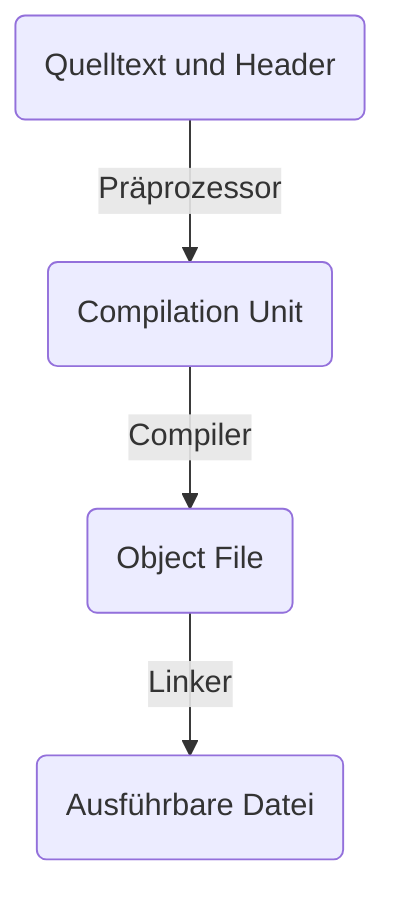

Folien: [[02_Imperative_Programmierung_mit_C++_04.pdf|Imperative Programmierung mit C++ - 04]]

# Bibilotheken
Eine (gute) C++-Bibliothek besteht aus:
- Dokumentation
- C++-Header-Dateien
- C++-Quelldateien bzw. (maschinenlesbare) Bibliothekdateien
- Namespace, um alles, was in der Bibliothek definiert ist, zusammenzufassen

## Codeaufteilung
### Header-Dateien
`*.hpp`
Enthalten:
- Klassendeklarationen
- Konstanten
- Funktionsdeklarationen
- Präprozessorkonstanten
- Präprozessormakros

### Quelldateien
`*.cpp`
Enthalten:
- Klassendefinitionen
- Funktionsdefinitionen
- Implementierungsdetails

## Eigenschaften von Bibliotheken (in C++)
Installiert man eine Bibliothek auf seinem System, so werden gespeichert:
- Header
- Bibliotheksdateien
- nicht der eigentliche Quellcode.

Wenn sich etwas an der Bibliothek ändert, was nur die Implementierungsdetails betrifft (nicht die Methodensignaturen), reicht es, die Bibliotheksdatei zu aktualisieren. Der Rest, auch alle Programme welche die Bibliothek benutzen, bleiben unberührt und müssen nicht erneut kompiliert werden.

Außerdem liegt eine geladene Bibliothek im Arbeitsspeicher und kann von allen Prozessen gleichzeitig genutzt werden.

# Der Übersetzungsprozess
Wir haben nun unseren C++-Code. wie wird daraus eine .exe?

Für den Präprozessor gibt es *Präprozessordirektiven* wie `#include` für Einbindung von Bibliotheken, `#define` für Kontanten und Makros, uvm, welche von ihm ausgewertet werden. Der Präprozessor entfernt außerdem überflüssigen Kram wie Kommentare und Zeilenumbrüche.

Die resultierende Datei wird vom Compiler in **Objektdateien** übersetzt, welche hauptsächlich Maschinencode sind, aber noch Platzhalter haben für Dinge wie unbekannte Funktionen und Konstanten.

Für das Füllen dieser Lücken ist der Linker verantwortlich. Er setzt die verschiedenen Objektdateien zu einer ausführbaren Datei zusammen, da er weiß, wo sich die jeweiligen Bibliotheken auf dem System befinden und wie das Betriebssystem die Prozesse startet.

# Einbindung von Bibliotheken
- Header kommen in `./include`
- Es kommt auch noch Kram in `./external`, aber wie das alles genau funktioniert wird nicht wirklich erklärt auf den Folien und das Skript ist ziemliche Grütze