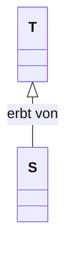

Datum: 21.12.
Folien: [[05_Objektorientierte_Programmierung_mit_C++_03.pdf|Objektorientierte Programmierung mit C++ - 03]]

# Objekte im Speicher
Zur Erinngerung: es gibt 
- den Programmspeicher mit dem ausführbaren Programmcode
- den Stackspeicher mit den Stackframes für alle Methoden, die gerade ausgeführt werden
- den Heapspeicher, um Objekte dynamisch (unabhängig vom aktuellen Stackframe) zu organisieren.

Reihenfolge beim Anlegen eines Objekts:
- Die Attribute des Objekts werden auf dem Stackframe abgelegt (für Attribute mit dynamischen Größen sind es Referenzen auf den Heap)
	- diese Attribute haben im Speicher eine feste Reihenfolge und werden als zusammenhängender Block abgelegt
- Konstruktor wird aufgerufen

Damit eine Memberfunktion weiß, aus welchem Objekt sie die Memberfunktionen laden soll, gibt es eine **Objektreferenz**.

Diese Referenz heißt in Python `self`, in C++, Java etc. `this`.
In C++ ist `this` ein Zeiger.

Es gibt also im technischen Sinne nur statische Funktionen, die dann im Moment des Aufrufs implizit den `this`-Zeiger als Argument mitbekommen.
Innerhalb einer Memberfunktion wird durch den Compiler immer `this->` vor Membervariablen gesetzt, auch wenn man es nicht explizit angibt.

# Vererbung

> **Liskovsches Substitutionsprinzip**
> Falls *S* ein Subtyp von *T* ist (also *S* ist spezieller als *T*), kann man *T* durch *S* ersetzen, ohne dass irgendwas dadurch kaputtgeht.

## UML
Vererbungen werden in UML durch einen Pfeil $\rightarrow$ von der spezielleren zur allgemeineren Klasse angegeben.

