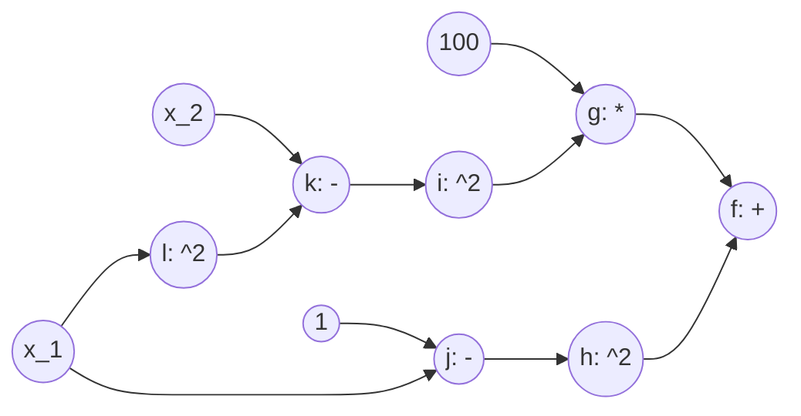
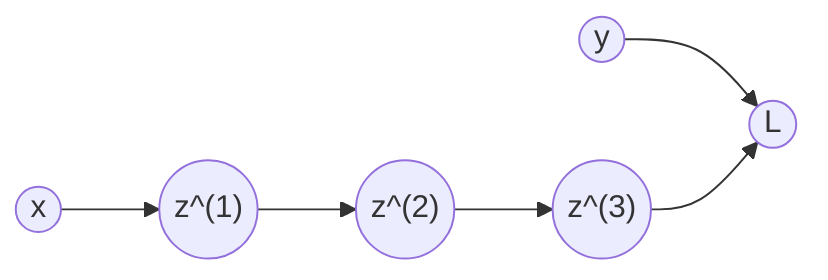

# DLVC - Übungsblatt 3

- Henning Lehmann

## a)

### 1.
Sei $a_{i} = w_{i} \cdot h_{i-1}$.
$$\begin{align*}
\frac{\partial h_{n}}{\partial w_{n-i}} &= \frac{\partial }{\partial w_{n-i}} \sigma(a_{n})\\
&= \sigma'(a_{n}) \cdot \frac{\partial a_{n}}{\partial w_{n-i}}\\
&= \sigma'(a_{n}) \cdot w_{n} \cdot \frac{\partial h_{n-1}}{\partial w_{n-i}}\\
&= \sigma'(a_{n}) \cdot w_{n} \cdot \ldots \cdot \frac{\partial h_{n-i}}{\partial w_{n-i}}\\
&= \sigma'(a_{n}) \cdot w_{n} \cdot \ldots \cdot \frac{\partial}{\partial w_{n-i}} \sigma(a_{n-i})\\
&= \sigma'(a_{n}) \cdot w_{n} \cdot \ldots \cdot \sigma'(a_{n-i}) \frac{\partial a_{n-i}}{\partial w_{n-i}}\\
&= \sigma'(a_{n}) \cdot w_{n} \cdot \ldots \cdot \sigma'(a_{n-i})h_{n-i-1}\\
&= \prod_{k=0}^{i-1}(\sigma'(a_{n-k})w_{n-k}) \cdot \sigma'(a_{n-i})h_{n-i-1}.
\end{align*}$$

## b)
DAG der Rosenbrock-Funktion $f$:

Gradient: $\nabla f = \begin{pmatrix}\frac{\partial f}{\partial x_{1}} \\ \frac{\partial f}{\partial x_{2}}\end{pmatrix}$

$$\begin{align*}\frac{\partial f}{\partial x_{1}} &= \frac{\partial f}{\partial g}\frac{\partial g}{\partial x_{1}} + \frac{\partial f}{\partial h}\frac{\partial h}{\partial x_{1}} = \frac{\partial g}{\partial x_{1}}+\frac{\partial h}{\partial x_{1}}.\\
\frac{\partial g}{\partial x_{1}} &= 100 \cdot \frac{\partial i}{\partial x_{1}}\\
\frac{\partial i}{\partial x_{1}} &= 2k \cdot \frac{\partial k}{\partial x_1}\\
\frac{\partial k}{\partial x_{1}} &= \frac{\partial x_{2}}{\partial x_{1}} -\frac{\partial l}{\partial x_{1}} = -2x_{1}\\
\Rightarrow \frac{\partial g}{\partial x_{1}} &= 100 \cdot 2k \cdot (-2x_{1}) = 100 \cdot2(x_{2}-x_{1}^{2}) \cdot (-2x_{1}) = -400x_{1}(x_{2}-x_{1}^{2}).\\
\frac{\partial h}{\partial x_{1}} &= 2j \cdot \frac{\partial j}{\partial x_{1}}\\
\frac{\partial j}{\partial x_{1}} &= -1\\
\Rightarrow \frac{\partial h}{\partial x_{1}} &= 2(1-x_{1})\cdot (-1) = 2x_{1}-2\\
\implies \frac{\partial f}{\partial x_{1}} &= -400x_{1}(x_{2}-x_{1}^{2}) + 2x_{1}-2.
\end{align*}$$

$$\begin{align*}
\frac{\partial f}{\partial x_{2}} &= \frac{\partial g}{\partial x_{2}} + \frac{\partial h}{\partial x_{2}}\\
\frac{\partial g}{\partial x_{2}} &= 100 \cdot \frac{\partial i}{\partial x_{2}}\\
\frac{\partial i}{\partial x_{2}} &= 2k \cdot \frac{\partial k}{\partial x_{2}}\\
\frac{\partial k}{\partial x_{2}} &= 1- \frac{\partial l}{\partial x_{2}} = 1.\\
\Rightarrow \frac{\partial g}{\partial x_{2}} &= 100 \cdot 2(x_{2}-x_{1}^{2}) \cdot 1 = 200(x_{2}-x_{1}^{2}).\\
\frac{\partial h}{\partial x_{2}} &= 2j \cdot \frac{\partial j}{\partial x_{2}} = 2j \cdot 0 = 0\\
\implies \frac{\partial f}{\partial x_{2}} &= 200(x_{2}-x_{1}^{2}).
\end{align*}$$

## c)

