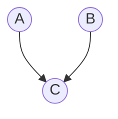

Datum: 16.05.

# Bayessche Netze

- Knoten: Zufallsvariablen
- Kanten: Abhängigkeiten
	- keine Kante impliziert Unabhängigkeit
- Keine Kreise: Bayessches Netz ist ein DAG

- A, B und C sind boolesche Variablen
- A und B erhalten A-Priori-Wahrscheinlichkeiten $P(A)$ und $P(B)$
- C erhält Tabelle für $P(C|A,B)$ für alle Möglichkeiten von $A$ und $B$
	- Ein Knoten mit $k$ Elternknoten hat eine Tabelle mit $2^{k}$ Einträgen

## Wie konstruiert man das?

1. Wähle Menge von Variablen
2. Ordne die Variablen
3. Nimm erste Variable
4. Analysiere, ob Abhängigkeit zu irgendwelchen Knoten im bestehenden Netz besteht
5. Streiche diese Variable aus der Liste

Die **Ordnung** hat einen großen Einfluss auf das Aussehen des Netzes, weil Abhängigkeiten nur evidenzbasiert bestimmt werden und umgedreht werden können

Die Abhängigkeiten können ggf. nur sehr schwer zu erfassen sein, und möglicherweise hat man auch wesentlich mehr davon

-> Ziel ist es (im Allgemeinen), ein *kausales Netz* zu erstellen

BNs, in welchen Kausalitäten umgedreht wurden, sind (bei korrekter Erstellung) immernoch akkurat, aber ggf. schwieriger zu erstellen.

## Inferenz in BNs

Gegeben: Instanziierte Evidenzvariablen (z.B. Messungen eines Agenten)
Gesucht: Wahrscheinlichkeitsverteilung von Anfragevariablen (Query durch Agenten)

-> $P(\text{Query}\mid \text{Evidence})$

$\alpha$ ist Normierungsterm, damit sich Wahrscheinlichkeiten auf 1 summieren (1 durch Summe von Werten)

Exakte Inferenz: Berechnung der Wahrscheinlichkeit durch Wertetabellen (NP-schwer)
Approximative Inferenz: Bestimmung der Wahrscheinlichkeit durch Zufallsexperimente

