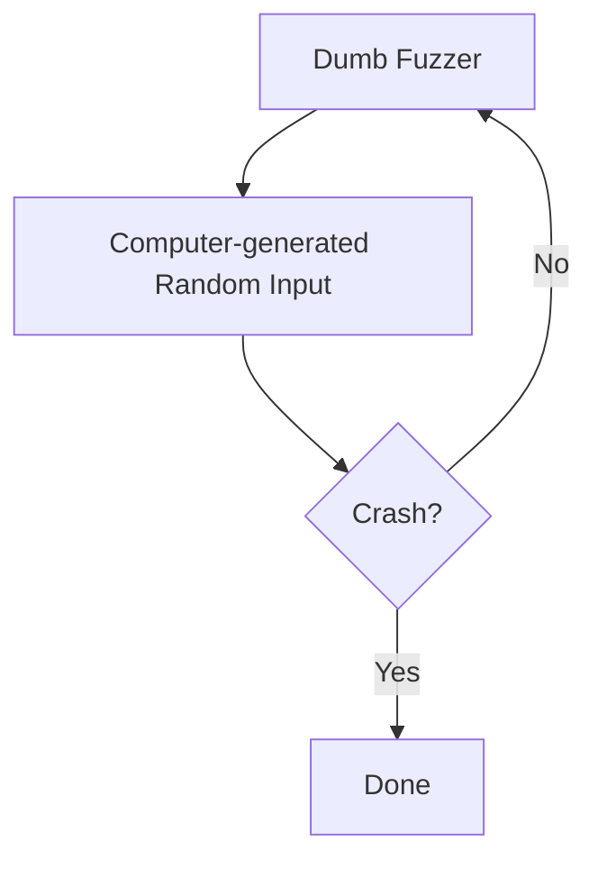
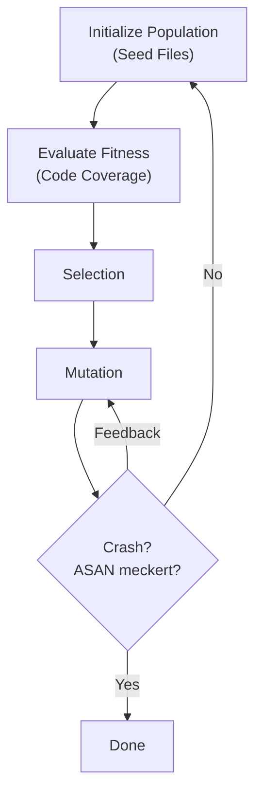

# Fuzzing
[[Master/Semester 1/IT Security/Slides/07 Fuzzing.pdf|Slides]]
[[Master/Semester 1/IT Security/Übungen/07 Fuzzing.pdf|Übung]]

> Ein **Fuzzer** ist ein Programm, das ein anderes Programm mit möglichst vielen eigenartigen Inputs ausführt, um Bugs zu finden.

Alte Herangehensweise (aus den 50ern): nimm irgendwelche Lochkarten aus dem Müll und füttere damit dein Programm, schau was passiert.

Falls das Programm sich aufhängt, hat es den Test nicht bestanden.
## Ansätze

Whitebox: 
- Komplette Kenntnis des Codes
- (Normalerweise) keine Ausführung des Codes (statische Analyse)

Blackbox:
- keine Kenntnis des Codes
- Code wird ausgeführt (dynamische Analyse)

Greybox: Kombination von Blackbox und Whitebox

> [!info] Instrumentierung
> Instrumentierung ist das Verändern von Quellcode, um seine Funktionsweise besser zu verstehen.

Instrumentierung passiert normalerweise zur Compilezeit - wir bauen zusätzliche Funktionen in unser Programm, um das Fuzzing zu ermöglichen / zu verändern.

Mögliche Instrumentierung: Adress Sanitizer (ASAN) -> macht Fuzzing langsamer, aber man findet mehr Bugs (buffer overflows etc.)
### Naiver Fuzzer

Black-Box Fuzzing:

### Coverage-guided Fuzzing

Code coverage kann als line coverage, oder Abdeckung eines Kontrollflussgraphen dargestellt werden.

Die Coverage kann dann als "Fitness" für einen genetischen Algorithmus verwendet werden, der Fuzzing-Inputs erstellt: 

Wie mutiert man?
- Das ist eine Wissenschaft für sich
- Grundlegend:
	- Bitflips
	- Bytes umsortieren
	- Random Strings
- Oft wollen wir keinen zufälligen Input, sondern z.B. eine valide JSON-Datei mit zufälligem Inhalt
	- -> grammar based fuzzing für strukturierten Input

## Praxis

Eine populäre Bibliothek heißt **LibFuzzer**.

*Instrumentierung des zu testenden Codes mit LibFuzzer:*
Kompilieren mit `clang`, setze Flags `--fsanitize=fuzzer-no-link`
ggf. mit Address Sanitizer: `--fsanitize=address,fuzzer-no-link`

*Fuzz Target:* eine Funktion, die ein paar Bytes entgegennimmt, daraus einen Input für die zu testende Funktion macht, und diese Funktion aufruft.

Kompilierung des Fuzz Targets:
- wird mit `fsanitize=fuzzer` kompiliert
- Einbindung von Header-Dateien: `-I<directory>`
- Einbindung des instrumentierten Codes:
	- `-L<directory>` um Ordner hinzuzufügen
	- `-l<libraryname>` um bestimmte Library zum Linken anzugeben