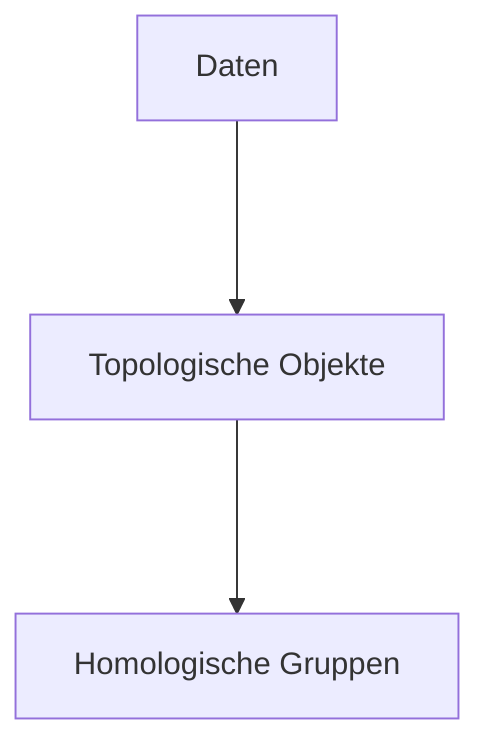

Datum: 28.11.
[[Master/Semester 1/IT Security/Slides/08 Topological Data Analysis.pdf]]

# Vorlesung: Topological Data Analysis

Werbung für Computational Topology

## Topologie

Geometrische Eigenschaften: Form, Größe, Position
Topologische Eigenschaften: Konnektivität und Kontinuität

> [!abstract] Definition *Topologie*
> Die Studie von Eigenschaften, die unter kontinuierlicher Deformation erhalten bleiben

Kontinuierliche Deformationen:
- Strecken
- Drehen
- Stauchen
- Biegen

Nicht-kontinuierliche Deformationen:
- Löcher hinzufügen/entfernen
- Reißen
- Kleben

**Terminologie**

*Metrischer Raum:*
![[Glossar#^dbdb6e]]

Ein metrischer Raum ist der Spezialfall eines *Topologischen Raums*, der lediglich den Begriff einer Nachbarschaft definiert.

Hat man eine Distanzfunktion $d$, ist der $\epsilon$-Ball ($\epsilon$-Nachbarschaft) eines Punktes $x$ definiert als die *offene* Menge $$B_{\epsilon}(x) = y \in X \mid d(x,y) < \epsilon.$$

## Topologische Datenanalyse

In der TDA sucht man in hochdimensionalen Daten nach *topologischen Invarianten*.

Allgemeiner Ansatz:

Beispiel für Daten:
- Punktwolke aus Messdaten eines bestimmten Geräts (z.B. CPU- und Speichernutzung)

Beispiel für topologisches Objekt:
- Simplizialkomplex

Beispiel für Homologische Gruppe:
- $H_{0}$ für Zusammenhangskomponenten
- $H_{1}$ für Schleifen (1-dimensionale Löcher)
- $H_{2}$ für Voids (2-dimensionale Löcher)
- ...

### Simplizialkomplex

Gegeben sei eine *Punktmenge* $P$.

Ein abstrakter Simplizialkomplex ist eine Menge $K$ von Teilmengen von $P$, sodass für jedes $k \in K$ alle Teilmengen von $k$ ebenfalls in $K$ enthalten sind.

Ein solcher abstrakter Simplizialkomplex kann geometrisch realisiert werden:
- jeder Punkt aus $P$ hat eine Koordinate
- $\forall p \in P: \set{p} \in K$
- jede Menge $k \in K$ wird repräsentiert durch die [ konvexe Hülle ] von $k$
- ist z.B. ein Dreieck in $K$ enthalten, sind alle Kanten dieses Dreiecks ebenfalls in $K$

#### Vietoris-Rips-Komplex

Ein einem metrischen Raum $(X,d)$ kann man durch einen Vietoris-Rips-Komplex einen Simplizialkomplex generieren.

Für eine Distanz $\epsilon>0$ ist der Vietoris-Rips-Komplex: $$\text{VR}_{\epsilon}(X) = \set{\sigma \subseteq X \mid \forall x,y \in \sigma: d(x,y) \leq \epsilon}.$$
### Persistente Homologie

#### Homologische Gruppen

Eine *Homologie* beschreibt algebraische Invarianten eines topologischen Raums (d.h. der konkrete top. Raum ist irrelevant, nur seine topologischen Eigenschaften werden erfasst).

Konkreter ist eine Homologie eines Raums $X$ eine [[Folgen#^731648|Folge]] von [[Gruppe#^07c2a6|abelschen Gruppen]] $H_{0}(X), H_{1}(X), \ldots$, wobei $H_{d}(X)$ die *$d$-dimensionalen Löcher* in $X$ beschreibt.

- Die Anzahl der 0-dimensionalen Löcher ist die Anzahl der [[Graphen#^9c3af1|Zusammenhangskomponenten]].
- Ein 1-dimensionales Loch ist eine Schleife, die nicht durch kontinuierliches Verschieben zu einem einzelnen Punkt kollabiert werden kann.
- Ein 2-dimensionales Loch ist ein eingeschlossener, dreidimensionaler Raum.

Die Anzahl der Löcher $b_d$ der jeweiligen Dimension $d$ heißt *Betti-Zahl*.

> [!example] Beispiele
> - Eine Kugel hat eine Zusammenhangskomponente, kein 1-D-Loch, und einen eingeschlossenen Raum.
> 	- $b_0=1,\,b_1=0,\,b_2=1$
> - Ein Torus hat eine Zhk, zwei 1-D-Löcher (eine Schleife um das mittlere Loch herum, eine Schleife hindurch), und einen eingeschlossenen Raum.
> 	- $b_0=1,\,b_1=2,\,b_2=1$
> - Ein Doppel-Torus (Genus $g=2$):
> 	- $b_0=1,\,b_1=2g=4,\,b_2=1$

#### Filtration

Man nehme einen metrischen Raum (Punktmenge).

Nun schaut man sich die Folge von verschiedenen [[ItSec - VL 8 - Topological Data Analysis#Vietoris-Rips-Komplex|Vietoris-Rips-Komplexen]] an, die entstehen, wenn man $\epsilon$ von $0$ bis $\infty$ laufen lässt.
-> zuerst hat man die leere Menge, dann alle Punkte, am Ende ist alles vollständig abgedeckt.

Nun kann man sich anschauen, wann die jeweiligen $d$-dimensionalen Löcher mit zunehmendem $\epsilon$ entstehen oder zerstört werden. Dies gibt einem dann eine Beschreibung der Struktur von seiner Punktmenge.

Je länger ein bestimmtes Loch bestehen bleibt, desto signifikanter ist es für die Struktur.

Visualisierung mit Persistenzdiagramm:

![[Persistenzdiagramm.png]]
Gesucht: Beschreibung dieser Datenpunkte für Vergleiche

Beispiel: Zahl und größe von leeren $\epsilon$-Bällen in diesen Punktwolken

#### Vergleich von Punktwolken

Wir haben zwei Punktwolken, und wir möchten quantifizieren, wie ähnlich sich diese Punktwolken auf topologischer Ebene sind.

- Wir berechnen das Persistenzdiagramm für beide Punktwolken
- 