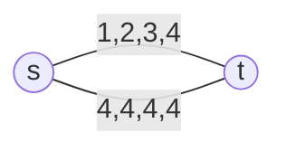

[[lecturenotes08.pdf]]

Die *Social Cost* eines Strategieprofils $s$ definieren wir als Summe von allen Kosten $c_{i}$ pro Spieler: $$SC(s)=\sum_{i \in N}c_{i}(s).$$

> [!abstract] Definition *Price of Anarchy*
> Für ein Equilibrium-Konzept $\mathrm{Eq}$ (z.B. ein PNE) ist der Price of Anarchy ($\mathrm{PoA}$) das Verhältnis der worst-case Social Cost unter diesem Equilibrium zur insgesamten best-case Social Cost:
> $$\mathrm{PoA}_{\mathrm{Eq}}= \frac{\max_{s \in \mathrm{Eq}}SC(s)}{\min_{s \in S}SC(s)}.$$

Beispiel: symmetrisches congestion game mit vier Spielern

Schlechtestes PNE: alle nehmen obere Kante, SC = 4\*4 = 16.
Beste SC: zwei oben, zwei unten - SC = 2\*2 + 4\*2 = 12.
-> $\mathrm{PoA}=\frac{16}{12}$

> Mit *affinen* Delay-Functions ($d_{r}(k)=a_{r} \cdot k + b_{r}$) gilt für alle congestion games: $$\mathrm{PoA}_{PNE}\leq \frac{5}{2}=2,\!5\,.$$

Schließlich gilt (sofern diese Equilibria existieren):
$$1 \leq \mathrm{PoA}_{\mathrm{PNE}} \leq \mathrm{PoA}_{\mathrm{MNE}} \leq \mathrm{PoA}_{\mathrm{CE}} \leq \mathrm{PoA}_{\mathrm{CCE}}.$$

## Smooth Games

Um obere Grenzen für den PoA eines Equilibrium-Konzeptes zu finden, hilft die *smoothness* eines Spiels:

> [!abstract] Definition
> Ein Spiel heißt $(\lambda,\mu)$-smooth, für $\lambda>0$ und $\mu<1$, falls für jedes Zustandspaar $s, s ^{*} \in S$ gilt: $$\sum_{i \in N}c_{i}(s_{i}^{*},s_{-i})\leq \lambda \cdot SC(s ^{*})+\mu \cdot SC(s).$$

Wir sind also im Zustand $s$, und summieren die Kost