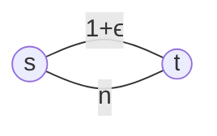

[[lecturenotes09.pdf]]

## Cost-Sharing Games

In einem Cost-Sharing Game *teilen* sich die Spieler die Kosten einer Ressource.

Der Price of Anarchy eines PNE kann hierbei sogar $n$ werden - wenn alle Spieler die untere Kante nehmen, hat man ein PNE. Das soziale Optimum wäre, wenn alle Spieler die obere Kante nehmen.

## Price of Stability

Beim Price of Stability gehen wir vom *best case* (statt wie beim PoA vom worst case) aus: $$\mathrm{PoS}_{\mathrm{Eq}}= \frac{\min_{p \in \mathrm{Eq}}SC(p)}{\min_{s \in S}SC(s)}\,.$$
> Der Price of Stability eines PNE in einem symmetrischen cost-sharing game ist 1.

Damit ist auch für alle anderen Equilibrium-Konzepte der PoS 1.

Das bedeutet: *jedes soziale Optimum in einem symmetrischen cost-sharing game ist ein PNE.*

