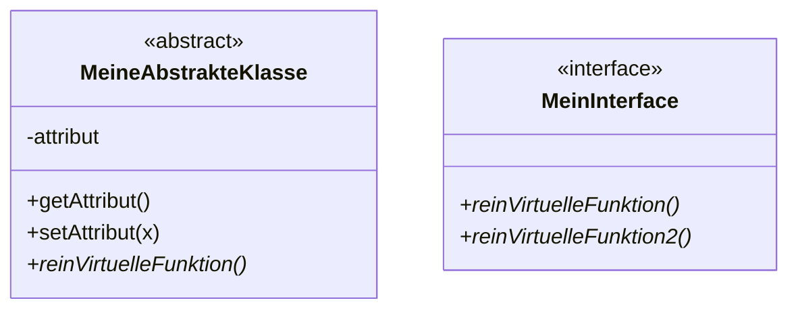
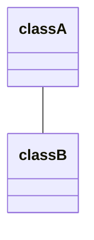
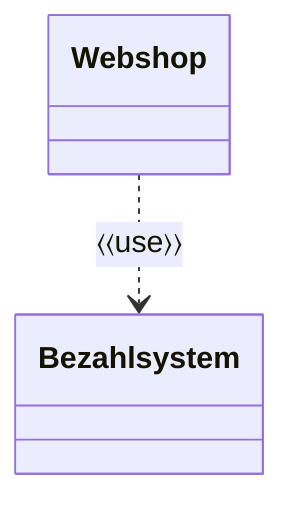
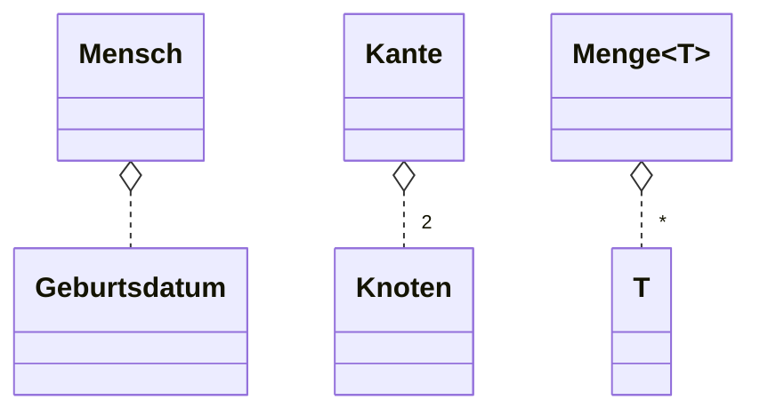
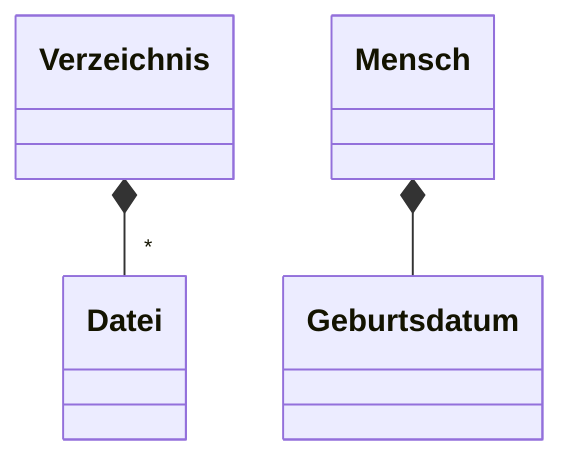

**Unified Modelling Language**
## Objektmodellierung
### Abstrakte Klassen und Interfaces

### Generische Typen
Beispiel `Node<T>`:
![[UML_Generischer_Datentyp.png|180]]

## Objekt- und Typbeziehungen
### Associations
Mit einer Association drückt man in UML aus, dass zwei Bausteine inhaltlich zusammengehören.

### Dependency
Eine Dependency drückt aus, dass ein Objekt inhaltlich von einem anderen abhängt. 
Die Use-Dependency drückt aus, dass ein Objekt ein anderes benutzt:

### Aggregation
Die Zusammensetzung eines Objekts wird durch Aggregations modelliert. Man drückt damit eine "Hat-Ein"-Beziehung aus.

### Composition
Eine Composition ist eine spezielle Form der Aggregation.
Compositions modellieren "Besteht-aus"- oder "Ist-Verantwortlich-Für"-Beziehungen. Spezialisierung von Aggregation.
Die Lebensdauer des unteren Objekts ist direkt abhängig von der Lebenszeit des oberen.

